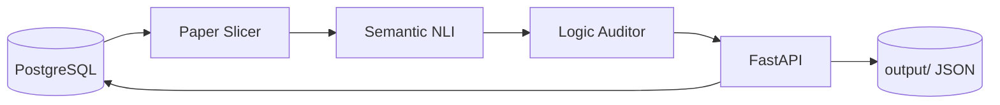

<div align="center">

# DeepLogicAuditor

**Academic Paper Logic Audit Agent**

Slice papers, build semantic graphs, and audit logical consistency with NLI models and rule-based checks.

[](LICENSE)
[](https://www.python.org/)
[](https://fastapi.tiangolo.com/)
[](https://pytorch.org/)
[](https://www.postgresql.org/)
[](https://github.com/wmlqq/DeepLogicAuditor/actions)

**[简体中文](README.md)**

</div>

---

## ✨ Features

| Module | Description |
|--------|-------------|
| 📄 **Paper Slicing** | Split Markdown papers into proposition-level segments |
| 🧠 **Semantic Modeling** | NLI-based entailment / neutral / contradiction detection |
| 🔍 **Logic Audit** | Contradictions, unsupported claims, missing transitions |
| 🔗 **Integrated Audit** | Load papers from PostgreSQL, score with LOG-001–LOG-007, persist results |
| 🌐 **REST API** | FastAPI endpoints with interactive Swagger UI |

---

## 🛠 Tech Stack

<p>
  
  
  
  
  
  
  
</p>

| Layer | Technology | Role |
|-------|------------|------|
| Runtime | Python 3.10+ | Core language |
| Web | FastAPI · Uvicorn | REST API & ASGI server |
| NLP | PyTorch · Transformers | [`cross-encoder/nli-deberta-v3-base`](https://huggingface.co/cross-encoder/nli-deberta-v3-base) |
| Graph | NetworkX | Semantic relation graphs |
| Data | PostgreSQL · psycopg2 | Papers, rules, audit results |
| Config | python-dotenv | Environment variables |

---

## 🏗 Architecture



```
Paper in DB → Slicing → Semantic modeling → Logic audit → DB + local JSON
```

---

## 📁 Project Layout

```
DeepLogicAuditor/
├── src/
│   ├── config.py
│   ├── database_connector.py
│   ├── logic_auditor/          # FastAPI entry & audit core
│   ├── semantic/               # NLI semantic modeling
│   └── slicer/                 # Paper slicing
├── prompts/keywords.json
├── tests/test_three_modules.py
├── docs/GITHUB_UPLOAD.md
├── .env.example
├── requirements.txt
└── run_api.py
```

---

## 🚀 Quick Start

**Requirements:** Python 3.10+ · PostgreSQL 12+ · (optional) CUDA

```bash
git clone https://github.com/wmlqq/DeepLogicAuditor.git
cd DeepLogicAuditor
python -m venv venv
venv\Scripts\activate          # Windows
# source venv/bin/activate     # Linux / macOS
pip install -r requirements.txt
copy .env.example .env         # Windows
# cp .env.example .env         # Linux / macOS
```

Edit `.env` with your database credentials. Optional: `HF_MIRROR`, `MODEL_CACHE_DIR`, `OUTPUT_DIR`.

```bash
python run_api.py
```

API docs: [http://localhost:8000/docs](http://localhost:8000/docs)

Integration test (requires paper data in the database):

```bash
python tests/test_three_modules.py
```

---

## 📡 API Overview

| Method | Path | Description |
|:------:|------|-------------|
| `POST` | `/audit/integrated?paper_id={uuid}` | Full audit pipeline from database |
| `POST` | `/audit/paper` | Audit a proposition graph (JSON body) |
| `POST` | `/audit/logic` | Audit a single text chunk |

<details>
<summary><b>Integrated audit rules (LOG-001–LOG-007)</b></summary>

| Rule ID | Name |
|---------|------|
| LOG-001 | Five-part abstract structure |
| LOG-002 | Three-level logic closure |
| LOG-004 | Terminology consistency |
| LOG-005 | Related-work section flow |
| LOG-006 | Experiments answer research questions |
| LOG-007 | Innovation count in conclusion |

</details>

---

## 🤖 Models & Cache

On first run, the NLI model is downloaded to `src/model_cache/` (override with `MODEL_CACHE_DIR`). **Do not commit model weights.**

```env
HF_MIRROR=https://hf-mirror.com
```

---

## 📄 License

[MIT License](LICENSE)

---

<div align="center">

**[简体中文](README.md)** · [Report an issue](https://github.com/wmlqq/DeepLogicAuditor/issues) · [Actions](https://github.com/wmlqq/DeepLogicAuditor/actions)

**Star ⭐ if this project helps you**

</div>
