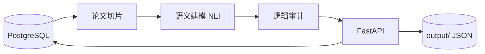

<div align="center">

# DeepLogicAuditor

**学术论文逻辑审计智能体**

对论文进行切片、语义建模与规则化逻辑审计，检测逻辑矛盾、逻辑跳跃、结构不完整等问题。

[](LICENSE)
[](https://www.python.org/)
[](https://fastapi.tiangolo.com/)
[](https://pytorch.org/)
[](https://www.postgresql.org/)
[](https://github.com/wmlqq/DeepLogicAuditor/actions)

**[English](README.en.md)**

</div>

---

## ✨ 功能特性

| 模块 | 说明 |
|------|------|
| 📄 **论文切片** | 将 Markdown 论文切分为命题级片段 |
| 🧠 **语义建模** | 基于 NLI 模型识别命题间蕴含 / 中立 / 矛盾关系 |
| 🔍 **逻辑审计** | 检测矛盾陈述、无支撑论证、衔接词缺失等 |
| 🔗 **一体化审计** | 从 PostgreSQL 读取论文，按 LOG-001～LOG-007 规则评分并写回 |
| 🌐 **REST API** | FastAPI 提供 HTTP 接口，自带 Swagger 文档 |

---

## 🛠 技术栈

<p>
  
  
  
  
  
  
  
</p>

| 层级 | 技术 | 说明 |
|------|------|------|
| 运行时 | Python 3.10+ | 主语言 |
| Web | FastAPI · Uvicorn | REST API 与 ASGI 服务 |
| NLP | PyTorch · Transformers | [`cross-encoder/nli-deberta-v3-base`](https://huggingface.co/cross-encoder/nli-deberta-v3-base) |
| 图分析 | NetworkX | 语义关系图构建 |
| 数据 | PostgreSQL · psycopg2 | 论文、规则与审计结果存储 |
| 配置 | python-dotenv | 环境变量管理 |

---

## 🏗 架构



```
数据库论文 → 切片 → 语义建模 → 逻辑审计 → 写回数据库 + 本地 JSON
```

---

## 📁 项目结构

```
DeepLogicAuditor/
├── src/
│   ├── config.py
│   ├── database_connector.py
│   ├── logic_auditor/          # FastAPI 入口与审计核心
│   ├── semantic/               # NLI 语义建模
│   └── slicer/                 # 论文切片
├── prompts/keywords.json
├── tests/test_three_modules.py
├── docs/GITHUB_UPLOAD.md
├── .env.example
├── requirements.txt
└── run_api.py
```

---

## 🚀 快速开始

**环境要求：** Python 3.10+ · PostgreSQL 12+ ·（可选）CUDA

```bash
git clone https://github.com/wmlqq/DeepLogicAuditor.git
cd DeepLogicAuditor
python -m venv venv
venv\Scripts\activate          # Windows
# source venv/bin/activate     # Linux / macOS
pip install -r requirements.txt
copy .env.example .env         # Windows
# cp .env.example .env         # Linux / macOS
```

编辑 `.env` 填入数据库连接信息。可选：`HF_MIRROR`、`MODEL_CACHE_DIR`、`OUTPUT_DIR`。

```bash
python run_api.py
```

API 文档：[http://localhost:8000/docs](http://localhost:8000/docs)

联调测试（需数据库中有论文数据）：

```bash
python tests/test_three_modules.py
```

---

## 📡 API 概览

| 方法 | 路径 | 说明 |
|:----:|------|------|
| `POST` | `/audit/integrated?paper_id={uuid}` | 从数据库读取论文并完成完整审计 |
| `POST` | `/audit/paper` | 对 JSON 命题图进行逻辑审计 |
| `POST` | `/audit/logic` | 对单一切片进行逻辑审计 |

<details>
<summary><b>一体化审计规则（LOG-001～LOG-007）</b></summary>

| 规则 ID | 名称 |
|---------|------|
| LOG-001 | 摘要五段式结构 |
| LOG-002 | 三级逻辑闭环 |
| LOG-004 | 术语一致性 |
| LOG-005 | 相关技术章节衔接 |
| LOG-006 | 实验回应研究问题 |
| LOG-007 | 创新点数量 |

</details>

---

## 🤖 模型与缓存

首次运行会下载 NLI 模型至 `src/model_cache/`（可通过 `MODEL_CACHE_DIR` 修改），**请勿提交模型文件**。

```env
HF_MIRROR=https://hf-mirror.com
```

---

## 📄 许可证

[MIT License](LICENSE)

---

<div align="center">

**[English](README.en.md)** · [报告问题](https://github.com/wmlqq/DeepLogicAuditor/issues) · [Actions](https://github.com/wmlqq/DeepLogicAuditor/actions)

**觉得有用？欢迎 Star ⭐**

</div>
